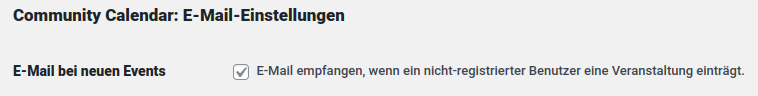

# Community Calendar Wordpress Plugin

The purpose of this plugin is to provide a straight-forward way of
displaying a calendar with public events. Users may submit events and have
them displayed in the calendar (after they have been revised and activated by
a page admin or editor).

A main goal for this plugin is to be simple in configuration, simple to use,
and to have a clean and tidy presentation of the events.

## Installation

1. Download or clone all the files from this repository into the plugins directory of your Wordpress
site (usually `wp-content/plugins/`). The directory must be named `community-calendar` (`git clone` will
create this directory for you).
```
cd <root_of_page>/wp-content/plugins
git clone https://github.com/gruenes-brett/community-calendar.git
```
2. Activate the plugin in the the admin area of your page

## Usage

The main purpose of this plugin is its usage together with the Grünes Brett WordPress Theme: https://github.com/gruenes-brett/webseite

## REST API

The plugin defines API endpoints for querying event data as JSON.

API entry point: `https://your.domain/wp-json/comcal/v1/`

| Endpoint | Description |
| --- | --- |
| `event/ev13456abc` | Query a single event by event ID |
| `event/byCategory/Catgory Name` | Query all events that belong to a certain category |
| `event/byOrganizer/Fridays For Future` | Query all events that have been created by a certain organizer |

Optionally, a parameter `?display` may be added to the URL in order for the description being returned as HTML
instead of raw text.

## E-Mail notifications

If non-registered user adds a new event, it will be hidden by default and needs to be
set public by an admin or an editor user (Redakteur). The non-registered user will
receive an email notification about his new event, including the link to the (hidden)
event. Admins and editors may enable a setting in their profile that they want
to receive an email notification about new anonymous events.



## Contributing

If you encounter problems with the plugin or have ideas for improvements and
useful features, please open an issue.

### Tests

Tests in the `tests` directory can be executed with phpunit. Use `composer install` to
install it and then execute tests while in the same directory as the `phpunit.xml` file:

```
./vendor/bin/phpunit
```

For debugging unit tests set the following on the command line:

```
export XDEBUG_CONFIG="idekey=VSCODE"
```

and launch "Listen for Xdebug" as described [here](https://tighten.co/blog/configure-vscode-to-debug-phpunit-tests-with-xdebug/).
